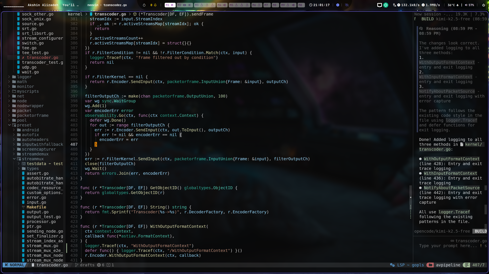

# Neovim Configuration

A personalized fork of [NvChad/starter](https://github.com/NvChad/starter) with enhanced AI assistance, VS Code-like UX, and optimized workflows.



## Quick Start

```bash
# Clone to your Neovim config directory
git clone <repo-url> ~/.config/nvim

# Start Neovim - plugins will auto-install
nvim
```

## Configuration Structure

```
~/.config/nvim/
├── init.lua              # Entry point: bootstrap lazy.nvim, load plugins
├── lua/
│   ├── options.lua       # Editor options + custom init
│   ├── mappings.lua      # Keymaps (VS Code style + NvChad defaults)
│   ├── autocmds.lua      # Auto-reload files on external changes
│   ├── chadrc.lua        # NvChad theme configuration
│   ├── configs/
│   │   ├── lazy.lua      # Lazy.nvim configuration
│   │   ├── lspconfig.lua # LSP server setup
│   │   └── conform_opts.lua # Formatting options
│   └── custom/
│       ├── init.lua      # Custom module loader
│       ├── plugins.lua   # Plugin definitions
│       └── lsp/          # Per-language LSP configs
│           ├── gopls.lua
│           ├── bashls.lua
│           ├── marksman.lua
│           └── qmlls.lua
└── after/                # After-load hooks
```

## Key Features

### 1. AI Assistants

| Plugin | Keybinding | Description |
|--------|-----------|-------------|
| `claudecode.nvim` | `<leader>ac` | Toggle Claude Code |
| `claudecode.nvim` | `<leader>as` | Send selection to Claude (visual) |
| `claudecode.nvim` | `<leader>ab` | Add current buffer to Claude |
| `CopilotChat` | `<leader>ccw` | Toggle Copilot chat panel |
| `CopilotChat` | `<C-i>` | YOLO inline execution |
Copilot suggestions: `<S-CR>` to accept, `<C-Right>` for word, `<C-Down>` for line.

### 2. VS Code-like Navigation

| Keybinding | Action |
|-----------|--------|
| `<C-p>` | Frecency file picker (recent files first) |
| `<S-f>` | Global search (live grep) |
| `<C-,>` / `<C-.>` | Previous/Next buffer tab |
| `<C-c>` | Close buffer |
| `<C-1>` ... `<C-9>` | Jump to buffer 1-9 |
| `<C-.>` (visual/normal) | LSP Code Action |
| `<leader>f` | Format buffer |
| `<leader>e` | Toggle file explorer |

### 3. LSP Configuration

Languages with LSP support:
- **Go** (`gopls`) - Workspace-aware root detection
- **Bash** (`bashls`)
- **Markdown** (`marksman`)
- **QML** (`qmlls`)
- **HTML/CSS** (`html`, `cssls`)

Mason auto-installs: `lua_ls`, `stylua`, `prettier`, `buf`, `marksman`, `gopls`, `html-lsp`, `css-lsp`, `bashls`

### 4. Editor Settings

```lua
-- Theme: vscode_dark with custom black background (#0A0A0A)
-- Auto-reload files when changed externally
-- Format on save via conform.nvim
-- Window title: "neovim - <filename>"
```

### 5. UI Enhancements

- **Barbar**: VS Code-style buffer tabs with numbers
- **NvimTree**: File explorer with git integration
- **Scrollbar**: VS Code-like scrollbar with diagnostics
- **Barbecue**: Breadcrumbs with LSP symbols
- **Render-markdown**: Pretty markdown rendering in AI chat

## Prerequisites

- Neovim 0.11+
- Git
- A Nerd Font (for icons)
- Node.js (for Copilot)

## Customization

### Change Theme

Edit `lua/chadrc.lua`:

```lua
M.base46 = {
  theme = "your_theme",
  hl_override = { ... }
}
```

### Add a New LSP Server

1. Add server name to `servers` table in `lua/configs/lspconfig.lua`
2. Create `lua/custom/lsp/<server>.lua` with server-specific options
3. Add to Mason's `ensure_installed` in `lua/custom/plugins.lua`

### Modify Keymaps

Edit `lua/mappings.lua` for general mappings or individual plugin configs in `lua/custom/plugins.lua`.

## License

CC0 - Public Domain Dedication. See [LICENSE](LICENSE)
